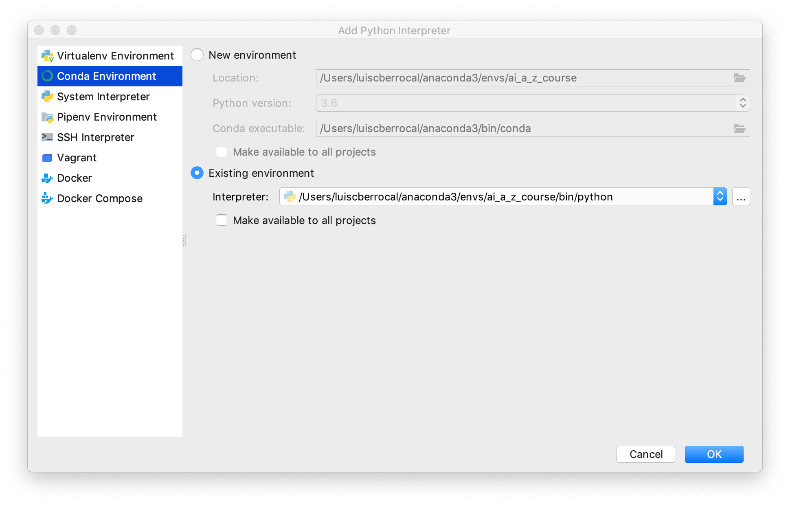
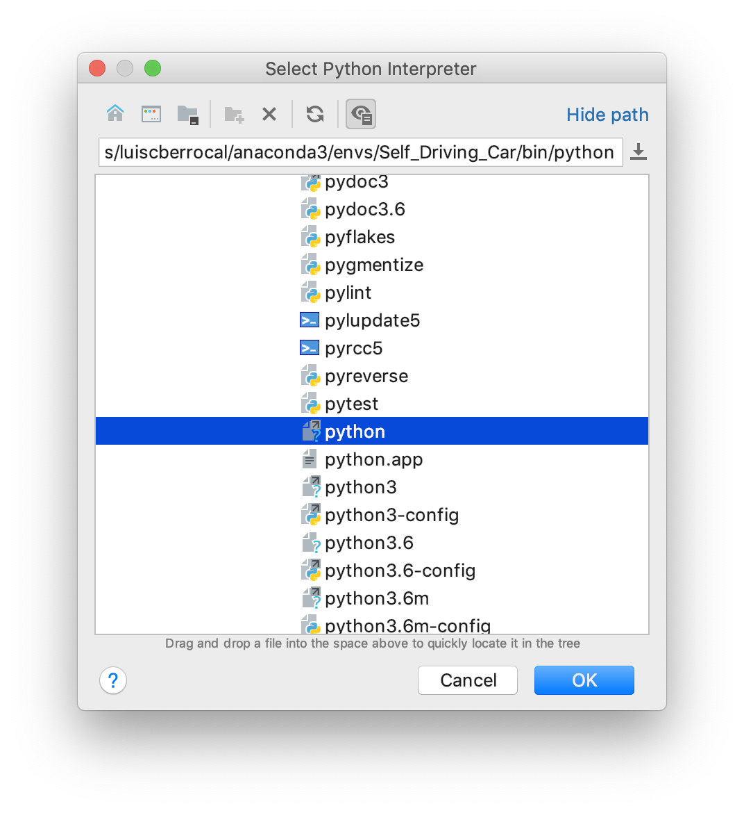
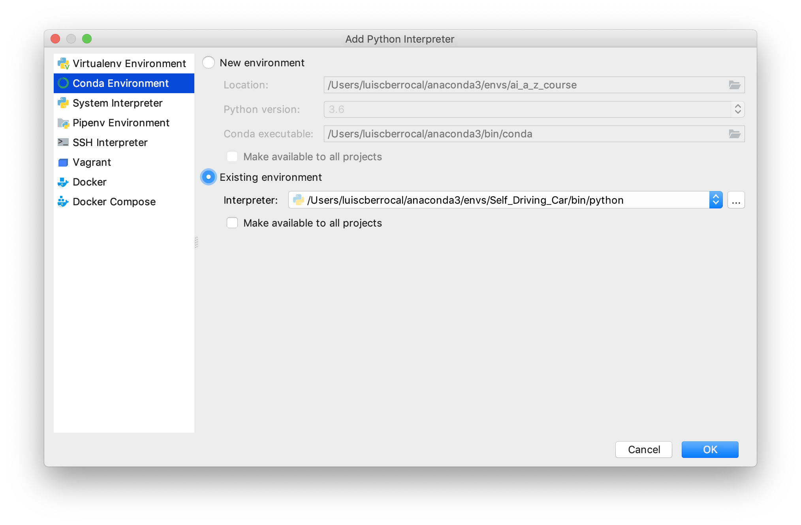
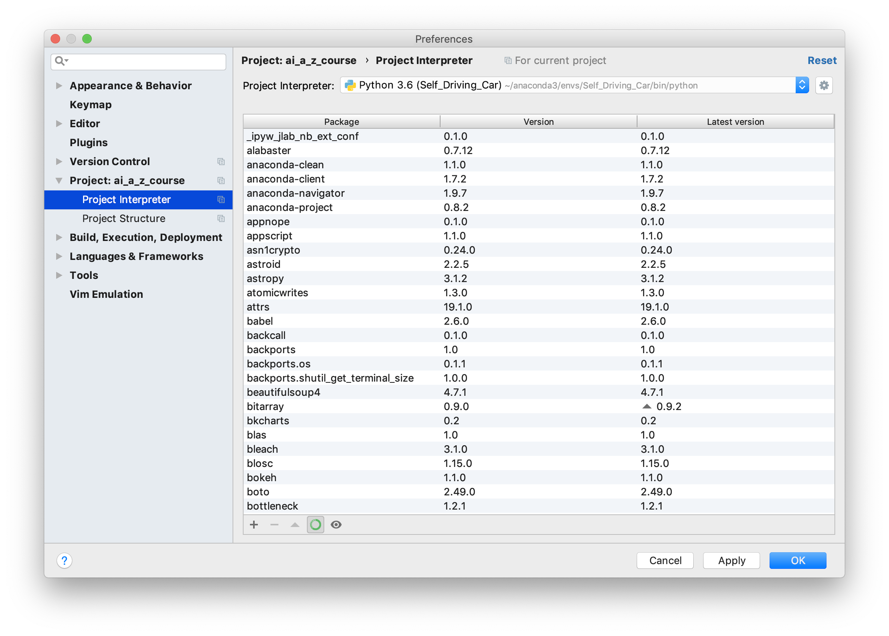

#Conda Environment

##Environment Configuration

Open **Anacanda Prompt** and run:
```
conda create --name ai_a_z_env

proceed ([y]/n)?
```
Run
```
conda activate ai_a_z_env
```
Run

```
conda install -c pytorch pytorch
conda install -c menpo ffmpeg
pip install gym
pip install gym-pull

```

###Error with orignal course instructions
When running this command ``conda install -c akode gym`` you get an error.

In question and anwers I found this

Thanks for sharing the error output! Which OS/version are you using?  You can install it with the pip commands and dependencies from here:

https://github.com/openai/gym

and

https://github.com/ppaquette/gym-doom


##PyCharm Configuration



On Windows the virtual environments are found in **C:\Anaconda3\envs** for example **C:\Anaconda3\envs\ai_a_z_env\python.exe**







